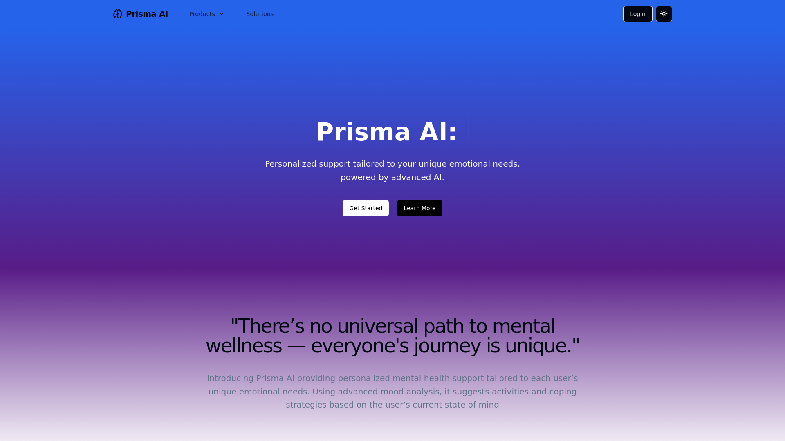

    updated on: 11th March 2025, Tuesday

<div align=center>
    <a href="https://github.com/SrijaAdhya12/prisma-ai">
        
    </a>
    <p style="font-family: roboto, calibri; font-size:12pt; font-style:italic"> When Mental Health meets Artificial Intelligence </p>
</div>

# [Prisma Ai](https://prisma-ai.vercel.app)

![line]

## Table of Contents

- [Problem Statement](#problem-statement)
- [Domain](#domain)
- [Proposed Solution](#proposed-solution)
- [Features](#features)
- [Future Scope](#future-scope)
- [Installation](#installation-guide)
- [Tech Stack Used](#tech-stack-used)
- [Docs](#docs)
- [Preview](#preview)
- [Best Contributors](#best-contributors)
- [License](#license)

![line]

## Problem Statement

-  **Limited Access**: Students often face long wait times for mental health services.
-  **Confidentiality Concerns**: Fear of stigma prevents students from seeking help.
-  **Lack of Support**: Mental health crises can occur outside of regular office hours.
-  **Mood Tracking Challenges**: Students struggle to monitor their emotional well-being.

![line]

## Domain

- AI powered Mental Health Support 

![line]

## Proposed Solution

-  **AI-Driven Virtual Companion:** Prisma AI serves as a virtual companion that offers personalized mental health support, interacting with users to understand and assist with their emotional well-being.
-  **Personalized Mental Health Support:** The platform tailors its recommendations to each user's unique emotional needs, ensuring that the support provided is relevant and specific to the individual.
-  **Advanced Mood Analysis:** Prisma AI uses advanced mood analysis techniques to assess the user's current emotional state, providing accurate insights into their mental well-being.
-  **Suggested Activities and Coping Strategies:** Based on the user's mood and emotional needs, Prisma AI suggests activities and coping strategies designed to help improve their mental state and overall well-being.

![line]

## Features

- **Mood Sense:** Daily mood tracking through a user-friendly calendar interface.
- **Video Sense:** Visual mood tracking with video feedback and personalized insights.
- **Support Bot:** Behavioral analysis through chat interactions, identifying patterns and traits. Providing supportive response through chat.
- **ProCare:** Access to professional therapist via chat
- **SupportNext:** Coping Environments 
- **Therafy**: Access to a library of GIFs, therapeutic music, jokes, and personalized recommendations.
- **Personalised Dashboard:**  Curated view of user health status and tracking of goal progress.

![line]

## Future Scope

- Dashboard for therapists
- Event organisers 
- Offline therapy sessions 
- Managed user groups
- Fitness tracker integration

![line]

## Installation Guide

  1. Download NodeJS >18.0.1
  2. Run the following commands for running client (frontEnd)
  3. set up `.env` with the help of `.env.example` file in both client and server
```sh
$> cd client
$> npm i       # install all packages
$> npm run dev # run the frontend
```
  3. Run the following commands for running server (backEnd)
```sh
$> cd server
$> npm i       # install all packages
$> npm start   # run the backEnd
```


![line]

## Tech Stack Used

Frontend:
* React
* Tailwind
* lucide-react
* tabler-icons
* Aceternity UI
* ShadCn
* Auth0
* Axios
* Stream chat
* Framer motion
* Face-api.js
* Spotify web api
  
Backend:
* Express.js
* Node.js
* MongoDB
* Mongoose
* Gemini 1.5 Flash
* Nodemon(only dev)
* Stream Chat


                       

![line]

## Docs

- [Project Presentation](https://drive.google.com/drive/u/0/folders/1yoJKAaeEUcE7E69RSkmYAOfzxho3qITq)
- [Project Analysis](https://docs.google.com/document/d/1dIcLnmPpMyJcy6Sn61tAYizZJ6sKa7iRT1qhgoezqK0/pub)

![line]

## Preview

<picture align="center">
    <source media="(prefers-color-scheme: light)" srcset=".github/preview-light.png">
    <source media="(prefers-color-scheme: dark)" srcset=".github/preview-dark.png">
    
</picture>

![line]

## Best Contributors

<div align="center">
    <a href="https://github.com/SrijaAdhya12/prisma-ai/graphs/contributors">
        
    </a>
</div>

![line]

## License

- See [LICENSE]

**Srija** & **Pritam, 2024**


![line]

## Thank you, everyone 💚

![line]

### Project by Team Axios

[icons]: https://icons8.com
[markdown-badges]: https://github.com/Ileriayo/markdown-badges
[custom-icons]: https://simpleicons.org
[line]: https://user-images.githubusercontent.com/75939390/137615281-3a875960-92cc-407f-97fe-fd2319bdb252.png
[License]: https://github.com/SrijaAdhya12/prisma-ai/blob/main/LICENSE

<!-- 01/10/24 -->
<!-- 11/03/25 -->
