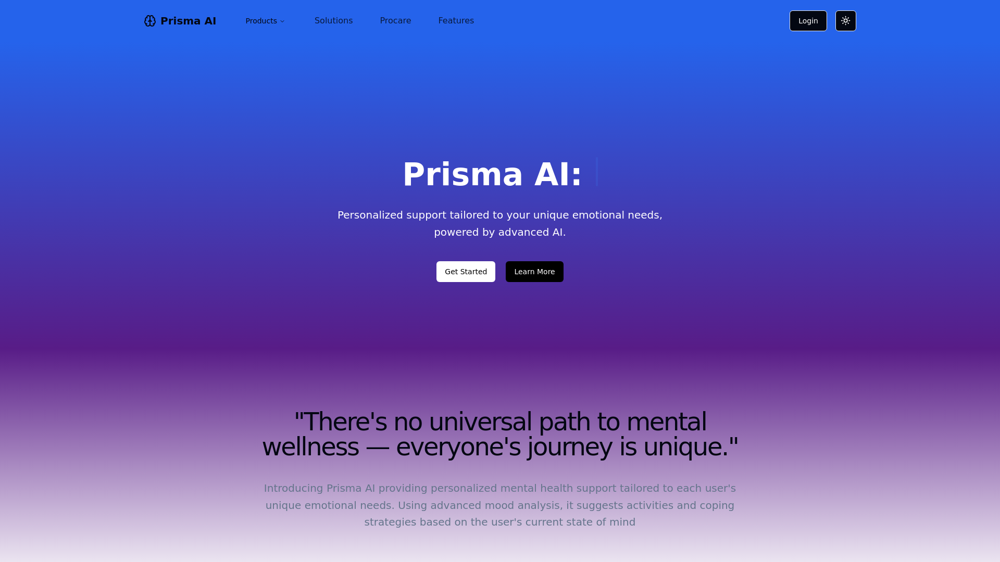

    updated on: 29th September 2024, Sunday

    
    
 AI Powered Mental Health Support 

    

# [Prisma Ai](https://prisma-ai.vercel.app)

![line]

## Table of Contents

- [Problem Statement](#problem-statement)
- [Domain](#domain)
- [Proposed Solution](#proposed-solution)
- [Features](#features)
- [Future Scope](#future-scope)
- [Installation](#installation-guide)
- [Tech Stack Used](#tech-stack-used)
- [Docs](#docs)
- [Preview](#preview)
- [Best Contributors](#best-contributors)
- [License](#license)

![line]

## Problem Statement

-  **Limited Access**: Students often face long wait times for mental health services.
-  **Confidentiality Concerns**: Fear of stigma prevents students from seeking help.
-  **Lack of Support**: Mental health crises can occur outside of regular office hours.
-  **Mood Tracking Challenges**: Students struggle to monitor their emotional well-being.

![line]

## Domain

- AI powered Mental Health Support 

![line]

## Proposed Solution

-  **AI-Driven Virtual Companion**: Prisma AI serves as a virtual companion that offers personalized mental health support, interacting with users to understand and assist with their emotional well-being.
-  **Personalized Mental Health Support**: The platform tailors its recommendations to each user's unique emotional needs, ensuring that the support provided is relevant and specific to the individual.
-  **Advanced Mood Analysis**: Prisma AI uses advanced mood analysis techniques to assess the user's current emotional state, providing accurate insights into their mental well-being.
-  **Suggested Activities and Coping Strategies**: Based on the user's mood and emotional needs, Prisma AI suggests activities and coping strategies designed to help improve their mental state and overall well-being.

![line]

## Features

- **Mood Sense**: Daily mood tracking through a user-friendly calendar interface.
- **Video Sense**: Visual mood tracking with video feedback and personalized insights.
- **Support Bot**: Behavioral analysis through chat interactions, identifying patterns and traits. Providing supportive response through chat.
- **ProCare**: Access to professional therapist
- **SupportNext**: Coping Environments
- **Therafy**: Access to a library of GIFs, therapeutic music, jokes, and personalized recommendations.

![line]

## Developement

-   Steps used for development of this project
-   Build processes
-   CI/CD commands
-   Docker commands

![line]

## Tech Stack Used

-   GitHub
-   Markdown
-   Prettier
-   Dependabot
-   GitHub Actions
-   Yaml
-   JavaScript

      

![line]

## Preview

<picture align="center">
    <source media="(prefers-color-scheme: light)" srcset=".github/preview-light.png">
    <source media="(prefers-color-scheme: dark)" srcset=".github/preview-dark.png">
    
</picture>

![line]

## Best Contributors

    

![line]

## License

-   See [LICENSE]

**Pritam Kundu, 2024**

![line]

## Thank you, everyone 💚

[icons]: https://icons8.com
[markdown-badges]: https://github.com/Ileriayo/markdown-badges
[custom-icons]: https://simpleicons.org
[line]: https://user-images.githubusercontent.com/75939390/137615281-3a875960-92cc-407f-97fe-fd2319bdb252.png
[License]: https://github.com/SrijaAdhya12/prisma-ai/blob/main/LICENSE

<!-- 29/09/24 -->
